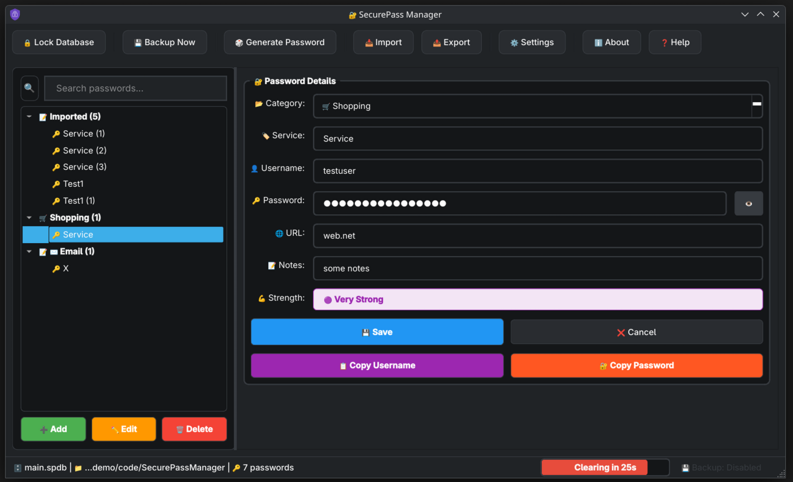

# SecurePass Manager - Your Ultimate Digital Vault

## Why Choose SecurePass Manager?

In today's digital world, we juggle countless online accounts - email, banking, social media, work applications, and more. Remembering unique, strong passwords for each service is virtually impossible, leading most people to reuse passwords or create weak, easily guessable ones. This creates a massive security vulnerability that hackers exploit daily.

SecurePass Manager solves this critical problem by providing a **military-grade encrypted vault** for all your credentials. Unlike cloud-based password managers that store your data on remote servers, SecurePass Manager keeps everything encrypted locally on your device. Your sensitive information never leaves your computer, ensuring maximum protection against data breaches and unauthorized access.

With sophisticated security features like automatic firewall protection, secure proxy support, and encrypted clipboard handling, SecurePass Manager goes beyond basic password storage to provide comprehensive digital protection. Whether you're a security-conscious professional, a privacy advocate, or someone who simply wants to stop forgetting passwords, SecurePass Manager offers the perfect balance of robust security and user-friendly convenience.

## Comprehensive Security Features

### 🔒 Military-Grade Encryption
- AES-256 encryption for all stored data
- Zero-knowledge architecture (we never see your passwords)
- Client-side encryption before storage
- Multiple encryption algorithms supported (AES-128, AES-256, ChaCha20)

### 🛡️ Advanced Security Integrations
- **Automatic Firewall Protection**: Blocks incoming connections by default
  - Windows: Netsh Advanced Firewall integration
  - macOS: PF firewall control
  - Linux: UFW firewall management
- **Secure Proxy Support**: Route traffic through encrypted proxies
  - HTTP/HTTPS/SOCKS5 protocols
  - Authenticated proxy support
  - System-wide or application-only configuration
- **Clipboard Security**: Auto-clearing clipboard with visual countdown
  - Configurable timeout (5-300 seconds)
  - Automatic clearing on app lock
  - Visual progress indicator

### 🛠️ Password Management Tools
- **Secure Password Generator**: Create uncrackable passwords
  - Customizable length (8-64 characters)
  - Multiple character sets (letters, digits, symbols)
  - Strength meter with visual feedback
- **Password Strength Analysis**: Real-time strength evaluation
  - Multi-factor strength calculation
  - Color-coded strength indicators
  - Custom password policies
- **Credential Organization**: Categorize entries for easy access
  - Custom categories (Social, Email, Work, Finance, etc.)
  - Powerful search and filtering
  - Tagging system for quick retrieval

### 🔄 Cross-Platform Accessibility
- Native desktop application
- Windows, macOS, and Linux support
- Consistent experience across platforms
- Responsive UI with theme support (Light, Dark, High Contrast)

### 🧠 Smart Automation
- Auto-lock with configurable timeout
- Automatic database backups
- Password expiration reminders
- Activity logging with multiple verbosity levels

## Detailed Feature Breakdown

### 1. Secure Credential Storage
Store unlimited passwords in your encrypted vault with these features:
- **Service-Specific Entries**: Save credentials for websites, applications, and services
- **Secure Notes**: Store sensitive information beyond passwords
- **Custom Fields**: Add additional security questions or verification codes
- **Password History**: Maintain previous password versions
- **Favorites System**: Pin frequently used credentials

### 2. Intuitive User Experience
- **Clean, Modern Interface**: Dark theme by default with light theme option
- **Three-Panel Layout**: Password list, search, and details view
- **Quick Actions**: Copy username/password with one click
- **Drag-and-Drop Organization**: Rearrange password entries
- **Keyboard Shortcuts**: Navigate quickly without touching your mouse

### 3. Security First Architecture
- **Local Storage Only**: Your data never leaves your device
- **Master Password Protection**: Single strong password protects everything
- **Encrypted Database**: Industry-standard AES-256 encryption
- **Memory Protection**: Sensitive data cleared from memory when not in use
- **Secure Session Handling**: Automatic logout after inactivity

### 4. Privacy Enhancements
- **No Telemetry**: We don't collect usage data
- **No Internet Connection Required**: Works completely offline
- **Open Source Transparency**: Verify our security claims yourself
- **Self-Destruct Feature**: Emergency wipe capability

## Getting Started

### System Requirements
- **Operating System**: Windows 10+, macOS 10.15+, or Linux (Ubuntu 20.04+)
- **Python**: Version 3.8 or higher
- **Disk Space**: 50 MB minimum
- **Memory**: 512 MB RAM

### Installation Guide

#### Method 1: From Source (Recommended for Security-Conscious Users)
```bash
# Clone the repository
git clone https://github.com/yourusername/SecurePassManager.git
cd SecurePassManager

# Create virtual environment (optional but recommended)
python -m venv venv
source venv/bin/activate  # Linux/macOS
venv\Scripts\activate     # Windows

# Install dependencies
pip install -r requirements.txt

# Launch application
python main.py
```

#### Method 2: Pre-built Packages (Coming Soon)
- Windows: `.exe` installer
- macOS: `.dmg` package
- Linux: `.deb` and `.rpm` packages

## Security Architecture Deep Dive

SecurePass Manager employs a multi-layered security approach:

1. **Encryption Layer**:
   - AES-256 encryption using industry-standard cryptography libraries
   - Key derivation using PBKDF2 with 600,000 iterations
   - Unique encryption key for each database

2. **Memory Protection**:
   - Sensitive data stored in secure memory areas
   - Automatic memory wiping after use
   - Protection against memory scraping attacks

3. **Network Security**:
   - Automatic firewall configuration
   - Secure proxy support
   - No outgoing connections except when explicitly configured

4. **Physical Security**:
   - Local database storage only
   - Optional USB drive operation
   - Self-destruct mechanism for emergency situations

## Frequently Asked Questions

### Is SecurePass Manager really secure?
Absolutely. We use industry-standard AES-256 encryption, which is the same encryption standard used by governments and financial institutions worldwide. Your master password is never stored anywhere - it's used to decrypt your database when you log in and immediately discarded.

### What happens if I forget my master password?
Due to our zero-knowledge architecture, we have no way to recover your master password. We recommend storing a physical copy of your recovery key in a secure location. This design ensures that not even we can access your data without your permission.

### Can I sync my passwords across devices?
Currently, SecurePass Manager is designed as a local application for maximum security. However, you can manually transfer your encrypted database file between devices. We're exploring secure synchronization options for future versions.

### How is this better than browser password managers?
Unlike browser-based password managers, SecurePass Manager:
- Stores passwords in an encrypted database rather than browser storage
- Provides advanced security features like firewall protection
- Offers secure password generation with customizable policies
- Protects against browser-based vulnerabilities and exploits
- Works across all browsers and applications

### Can I import passwords from other managers?
Yes! We support importing from:
- LastPass
- 1Password
- Bitwarden
- KeePass
- Browser exports (Chrome, Firefox, Edge)
- JSON files
- CSV files

## Roadmap: What's Coming Next

- [ ] **Mobile Applications**: iOS and Android versions
- [ ] **Secure Cloud Sync**: End-to-end encrypted synchronization
- [ ] **Biometric Authentication**: Fingerprint and face recognition
- [ ] **Password Breach Monitoring**: Check against known breaches
- [ ] **Two-Factor Authentication**: Built-in 2FA code generator
- [ ] **Password Sharing**: Secure sharing with family/team members
- [ ] **Emergency Access**: Designated contacts for emergency access

## Join Our Security Community

We believe security is a collaborative effort. Join our community to:
- Report security vulnerabilities
- Suggest new features
- Contribute to development
- Help improve documentation

**GitHub Repository**: [https://github.com/bouness/SecurePassManager](https://github.com/bouness/SecurePassManager)  

## 💖 Support

Scan to donate via Venmo:


## Screenshots

| Login Screen | Main Password Vault |
|--------------|---------------------|
|  |  |

| Security Settings | Password Generator |
|-------------------|--------------------|
|  |  |

## License

SecurePass Manager is released under the **MIT License** - see the [LICENSE](LICENSE) file for details. This permissive license allows both personal and commercial use while maintaining our commitment to open-source transparency.

---

**Ready to take control of your digital security?** Download SecurePass Manager today and experience the peace of mind that comes with truly secure password management.